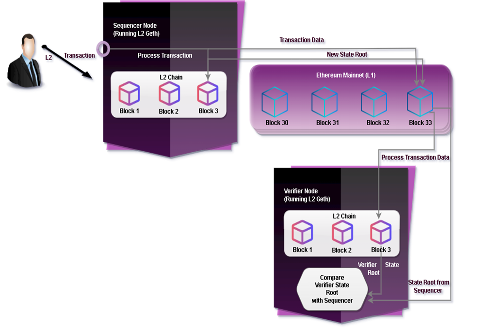

# How XHAVIC Works

## Transaction Submission

This system depends on two different kinds of transactions: L2 transactions, which take place between two addresses on the L2 chain, and cross chain transactions, which happen between the L1 and L2 chains. The L2 transaction process is explained in a little more detail in the workflow that follows than in the basic workflow.

<figure><figcaption></figcaption></figure>

## L2 Transaction Workflow

If a transaction is sent to the sequencer node by a user and is found to be legitimate, the sequencer will immediately add it to the L2 chain (note that at this time, just the sequencer node has added this transaction to its copy of the L2 chain). L2 only allows for single-transaction blocks, therefore as soon as a new transaction is added, a new block is added to the chain. Since the sequencer now performs the duty of the miner, there are no miners competing to mine new blocks in L2.

The sequencer will then call a smart contract on L1 (deployed by the Optimism team prior to release) after adding a few transactions to the L2 chain and send it the transaction data for all of those L2 transactions as well as the new state roots of the L2 chain after applying each transaction.

The smart contract on L1 will efficiently (using Sliceledger) store the transaction data and state roots in another smart contract created for storage.

The verifier nodes will include the transaction in their copy of the L2 chain once the transaction data has been deposited on L1.

The user who is being restricted by the sequencer will still be able to input the transaction data and invoke the smart contract themselves. The sequencer will then be required to complete that transaction in a specific amount of time. If not, their link might be reduced.

Furthermore, it has already been noted that the verifier examines the transactions that the sequencer posts to L1. Verifiers do have the option to sync from L2, in which case they would receive new transactions straight from the sequencer, possibly before they were pushed to L1. The sequencer may post this transaction to L1 but there is no assurance that it will do so with this sync from L2 technique.

## Cross Chain Transactions

In order for users to be able to invoke contracts on other chains or transmit ETH/tokens from one chain to another, cross-chain transactions are required in this system. Given that they involve both chains, these transactions have a slightly different workflow than L2 transactions.

L1-> L2 Transactions

The sequencer simply relays the message to the L2 chain in transactions from L1 to L2, which are quite quick. Users will provide the necessary information for their transactions to a bridge smart contract on Layer 1 (L1), and this smart contract will add the transaction to a queue of transactions that the sequencer must add to Layer 2 within a predetermined amount of time. Therefore, the transaction will finally be transmitted to the L2 chain by the sequencer.

<figure><figcaption></figcaption></figure>

For example, if a user wants to send 10 ETH to their address on L2 so that they can interact with smart contracts on L2, the following steps will happen:

* The user sends 15 ETH to a bridge contract on L1.
* The contract locks the ETH on L1.
* The contract also adds the user’s transaction to the queue of transactions that the sequencer must add to L2.
* The sequencer processes this transaction and the ETH is successfully deposited to the user’s L2 account.

**Note:** On L2, WETH, an ERC20 wrapped token, has taken the place of ETH. This will aid L1 transaction replay ability, which will be described later. The user's L2 account will receive a deposit of 15 WETH as a result of the transaction. Additionally, when a token or WETH is sent to L2, the bridge contract may actually be two smart contracts cooperating. The Optimism team will offer these bridging contracts upon launch.

## L2 -> L1 Transactions

Because the L1 chain frequently needs to confirm the validity of the L2 state root following the transaction (which began on L2), transactions from L2 to L1 can be more challenging. In most cases, the user will transmit the transaction to a particular L2 smart contract. Relayer will then read it and transmit it to L1. A JavaScript service that serves as the relayer has been made available by optimism. It communicates with L2 by means of the sequencer and verifier nodes.

<figure><figcaption></figcaption></figure>

As an illustration of an L2 to L1 transaction, consider what would take place if a user wanted to convert their 15 WETH on L2 address back to ETH on their L1 address.

* 15 WETH are sent by the user to a bridge contract on L2.
* The L2ToL1MessagePasser smart contract receives the transaction details from the bridge contract after burning the WETH. The information for transactions that must be transferred from L2 to L1 is recorded in this smart contract.
* The relayer node gets this transaction data from the L2ToL1MessagePasser and delays forwarding the transaction to L1 for the duration of the fraud proof window (7 days).
* The customer can now withdraw their ETH when the transaction has been processed on L1. The bridge contract that froze their ETH when it was initially transmitted to L2 will be released.

The verifier nodes have adequate time to determine whether the state root reported by the sequencer for this transaction is accurate thanks to this fraud-proof timeframe.

## Transaction and state root storage on L1

Since each transaction's transaction data and resultant state root must be saved on L1, it is essential to keep this data's size as little as possible to reduce the system's storage expenses. The steps that each L2 transaction's data is stored on L1 are described below:

* The sequencer creates a batch by combining the calldata for several consecutive L2 transactions.
* The sequencer then delivers this batch to the CanonicalTransactionChain smart contract.
* The smart contract then generates a merkle tree using the hashes of the calldata for each transaction.
* The merkle root of this batch is sent to a smart contract designed for storage by the CanonicalTransactionChain.

<figure><figcaption></figcaption></figure>

In essence, this procedure involves adding up several transactions, building a Merkle tree, and storing the root. The same procedure also applies to storing state roots. The StateCommitmentChain is the name of the contract that is used to roll up state roots. The insertion of a new merkle root to the storage contract is currently the only modification to the L1 state for a sequence of L2 transactions. As opposed to keeping each transaction independently in the storage contract, this greatly improves the system's efficiency. This procedure is shown in the above diagram.
